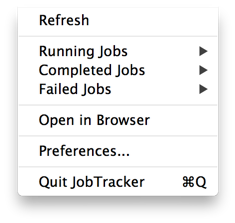

英文原文: [Tracking Hadoop Jobs from Your Mac: There’s an App for That](http://blog.cloudera.com/blog/2013/05/tracking-hadoop-jobs-from-your-mac-theres-an-app-for-that/)，翻译：[ImportNew](http://www.importnew.com) - [Royce Wong](http://www.importnew.com/author/roycewong)
##专为Mac本跟踪Hadoop 任务的应用##
先把感谢送给Etsy开发者Brad Greenlee ([@bgreenlee](https://twitter.com/bgreenlee))。我们认为他的针对JobTracer的Mac OS应用非常好！

[JobTracker.app](http://bgreenlee.github.io/JobTracker)是一个针对Hadoop JobTracker的Mac菜单栏应用。它提供了对Mapreduce 任务启动、完成、失败的通知，并可轻松访问这些任务的详细页面。

当我在[Etsy](https://www.etsy.com/)开发Apache Hadoop 任务时，发现自己为了知道自己的任务执行进度而去不断的查看Jobtracker页面，这占据了非常多的时间(话说译者坚决同意)。首先我们尝试去解决这个问题，写了一个[Scalding](https://github.com/twitter/scalding) 工作流监听器将已经完成和失败的任务发布给IRC，但是这个有点吵闹。所以我写了这个JobTracker.app。

### 安装和使用 ###
你可以从[GitHub project page](https://github.com/bgreenlee/JobTracker)下载二进制文件。使用unzip解压它然后将它放到你的应用文件夹里。运行它，a little pith helmet()出现在你的菜单栏上。点击它就会看到下面的菜单。

首先你必须在Preferences里输入你的JobTracker URL地址:

默认情况下，它会跟踪所有任务。很可能你不想这样，所以将你的用户名和其他你想查看的用户名输入到“Usernames to track文本框中，多个使用英文逗号隔开即可。

注意应用仅在Etsy内部使用的Hadoop版本测试过。这个APP使用了有点可怕的方式获取JobTracker数据（通过解析JobTracker页面，因为当前除了通过java程序还没有api去访问JobTracker），在不同的版本上应用可能会失效。如果你想使用它但没有成功，在GitHub上[提交一个issue](https://github.com/bgreenlee/JobTracker/issues)，我会为你解决。

### 未来发展 ###
待开发的特性列表中，下步将会是[同时跟踪多个集群](https://github.com/bgreenlee/JobTracker/issues/2)。如果你有任何请求，请[告诉我](brad@etsy.com)。

