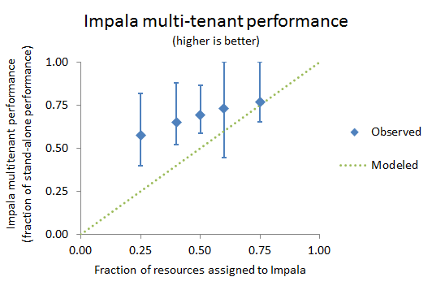
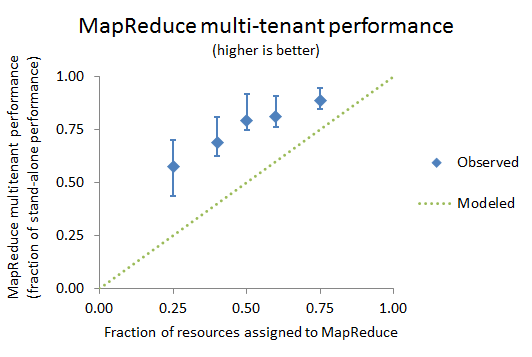

原文标题：Configuring Impala and MapReduce for Multi-tenant Performance(http://blog.cloudera.com/blog/2013/06/configuring-impala-and-mapreduce-for-multi-tenant-performance/)

##为多租户场景集群配置Impala和Mapreduce##
[Cloudera Impala](http://blog.cloudera.com/blog/2013/05/cloudera-impala-1-0-its-here-its-real-its-already-the-standard-for-sql-on-hadoop/)包含很多令人惊喜的特性，但是其给人印象最深的应该是支持以多种格式分析HDFS和HBASE中数据的能力，并且不需要ETL。此外，用户可以使用多个框架如mapreduce和impala分析相同的数据。因此，Impala 可以和mapreduce一起运行在相同的物理机器上，支持企业的关键业务。对那些多租户（**这里的多租户指多计算框架，如集群运行了Impala和Mapreduce**）的集群，尽管存在着可能的对集群资源需求的潜在冲突，Impala和Mapreduce都需要运维好。

这篇文章，将分享作者在配置Impala和Mapreduce过程中认为最理想的多租户运维环境的经验。目标就是帮助用户理解怎样去对多租户集群进行调优满足产品的服务水准(SLOs)，并向社区贡献一些有用的，事半功倍的测试方法和性能模型。

###定义实用测试场景###
Cloudera面对的是广泛和多样的客户群体，所以这使得为现实世界场景做测试是头等大事。基于普通的使用案例的现实测试提供了有意义的指导，反之，人为地，不切实际地测试得出的结论在作用到实践中时通常失败。

对于Impala，主要的测试工作量就是直接复制Impala用户的查询，schema，以及数据选取。我们使用这个方法测试几种不同类别的用户案例的查询和schema结构，通常会和客户一起合作，对所有的cdh组件得到相似的实际测试场景。在对他们指定的使用案例获得直接的性能结论过程中，客户也一样受益匪浅。

因为OLAP（online analytical processing）是用户使用Impala案例中最多的一个，我们也运行[TPC-H](http://www.tpc.org/tpch/),一种在OLAP建立的基准测试，是对Impala的第二个工作。尽管TPC-H提供了大量、公共的独立审计结果的资源（这些结果是基于上世纪90年代的一次OLAP用户调查得到的），所以现在我们运行这个著名的TPC-H查询的子集。

对于MapReduce，使用各种基准测试来对不同数据格式，对MR计算管道不同阶段不同压力进行测试。比如TeraSort套件（包括TeraGen，TeraSort和TeraValidate），数据清洗作业，处理数据中随机性不同量值。这些测试不同于其他的MR测试，比如使用类似SWIM的开源工具直接重现客户的成千上万道作业造成的工作负载。这些负载捕捉复杂并且多样，将会在未来添加。与之相比，我们开展的多租户测试，可以对测试进行精确控制，并容易重复进行。

多租户测试包含Impala查询、与MR并行基准测试等整套环节，并循环这个过程（每次，不同的impala查询使用不同的mr作业）。再加上各种体积的数据，不同的数据格式，并行运行Impala查询的不同，MR作业并行的不同，最后的结果会是一个百种参数设置的结果矩阵。这个测试矩阵给了我们信心，这样出现的结果是有意义的，并且Impala可以和MR像期待的那样一起在同一个集群中共用。

###多租户性能期望建模###
多租户资源管理涉及到将不同的资源分配到不同的计算框架的作业中。为数百个测试案例的所有矩阵数据建模是难以实现的。不过，以简单的方式，我们可以将资源分配简化为一句话：“当集群资源被争用时，Impala获得所有资源的x部分，而MR得到其余的”。

如果Impala和MR资源共享和谐，其性能应随着其占有资源的比例下降而下降。也就是说，Impala的多租户性能应不低于其独占所有资源时性能的比例值x部分，MR也不应低于其独占资源时性能的1-x部分。目标就是找到并验证资源管理控制的一系列方法，一道道满足期待的性能或者甚至超出期望。

这是理论上最简单的模型也可能是更复杂的。例如如果MR作业运行时间比Impala查询长，多租户运行放缓只在两者都运行时出现。那个Impala查询将达到前面所说的x比例的性能。而那个MR作业在作业起始时获得1-x比例的性能，而剩下的过程将获取到所有资源时的性能。

这个模型的另外一个扩展是覆盖不均匀的资源分配过程。例如大多数的Impala查询需要大的内存需求，而MR作业需要较多得IO资源。如果分配给Impala 50%的CPU，60%的内存，40%的硬盘IO，所有资源变化可同时影响性能，并且我们期待整体上性能降低范围在40-60%之间。这个比较复杂的伴随着多维度的资源分配模型在cdh是支持的，这里暂时不讲。

###共享资源的控制###
多租户资源管理控制套件在另一篇文章里"[ Setting up a Multi-tenant Cluster for Impala and MapReduce](http://www.cloudera.com/content/cloudera-content/cloudera-docs/CM4Ent/latest/Cloudera-Manager-Installation-Guide/cmig_impala_res_mgmt.html)"(包含在Cloudera Manager 安装指导中)。套间里包含了对每个运行的计算框架的内存管理、CPU、IO管理等。文档中含有几个例子，和指导怎样配置下面的资源：

* **Memory.** 包含Impala内存限制。直接对Impala可消耗内存、最大同时运行的Map任务数、Reduce数设置。间接对MR内存控制。对于内存管理，主要关注点是防止内存的波动，作业或查询失败，或者任何框架对所有资源的独占导致的阻止其他框架运行程序。

为了设置总物理内存的比例x，设置Impala内存限制为（RAM/accounting factor）*x. 其中accounting factor是操作系统常驻内存中实际可用内存的参数常量，可用来调整服务器负载。发现值为1.5是相对安全的值，而1.3则更理想但更危险。

对于Mapreduce，对map和reduce任务数的最大值应为默认值的1-x。例如假设给了Impala所有集群资源的25%，则x=25%，那么map和reduce最大锁业数就为默认值的75%。如果并行map任务数最大默认值为16，reduce最大默认值是8，那么新值就分别应该是12和6。当每个任务在其子jvm容器中运行通过map()和reduce()方法处理数据时，这样可以有效地让Mapreduce使用其余剩余的1-x部分集群的内存资源。对应着这一变化，任何一个作业的调优与槽容量调优有关的都需要随之做变化（因为槽资源减少了）。注意，在MR1中槽是最小的调优单元。对未来的CDH5和YARN来说，反而可能会指定具体的内存使用量。YARN会对应用各主服务器（他们中得一个要运行MR作业）进行资源分配。

* **CPU.** 我们通过[Linux Control Groups（Cgroups）](http://www.cloudera.com/content/cloudera-content/cloudera-docs/CM4Ent/latest/Cloudera-Manager-Managing-Clusters/cmmc_resource_mgmt.html)来控制CPU的使用。Cgroups是Linux kernel 提供的一个特性，用户可以通过Cloudera Manager 4.5.x及以上版本配置。CGroup cpu共享给一个角色资源越多，其在资源竞争时共享的cpu资源就越大。例如，一个进程在4核cpu上运行占有的cpu时间是在2核机器上的2倍。这个控制称为soft limits（软限制），当服务器上运行进程既有来自cloudera manager管理的角色，同时有其他系统进程时，那个设置就没有效果了。

在多租户环境中，所有的Impala和Mapreduce进程，包含Impala后台进程，DN、TT等，可能会同时抢占cpu资源。设置cpu资源的x部分给Impala，每个节点上其余的资源的一半给dn和tt，这样即可达到将cpu的x部分给impala，mapreduce占有其余的资源。

这个对mapreduce来讲是保守的设置，这里假定dn和任务计算可以同时运行，最大化cpu的使用。如果你的mr负载远远低于集群资源总量，这个设置就不那么靠谱。例如，当你只有一个mr作业，通常作业输入输出使用的DN和TTcpu使用不会同时。只有当你有非常大的负载，那么整体上可以说dn和tt使用是同时的。

* **Disk.** 磁盘IO资源也通过Cgroups来控制。角色被授予的Cgroup IO比重越大，其IO请求的优先级就越高。这个和CPU管理效果几乎一致。

我们选择了一个比较保守的磁盘资源配置：Impala后台进程使用磁盘IO比重x的部分，其余的（即1-x部分）中得一半给DN，另外的给TT。

###多租户性能数据###

测试目标：

*    衡量未管控多租户下集群使用效果
*    衡量使用资源管控多租户状态下的性能
*    研究上面2种情况下的资源竞争
*    研究面向资源控制的独立运行效能

测试集群有64GB内存，12核 2.0GHz Intel Xeon， 12 * 2TB磁盘，10Gbps带宽。

测试基准性能是在MapReduce和Impala均无资源控制情况，并且均独立运行。我们称为未管控独立性能（uncontrolled, stand-alone performance）。		这是非常好的基准性能，因为没有资源控制，独立安装在研究Mapreduce或者Impala集群都是公平的。

### 未管控集群性能###

如前所述，我们测试了多租户无资源控制情况下集群性能。测试中，MapReduce消耗了大部分集群资源，大大影响了IMpala的性能。尤其是，**没有资源控制的Mapreduce性能是未资源控制独立运行性能的90%，而Impala大概是独立运行的50%。**

这些数据比预测的要高。原因是Impala和Mapredue资源需求并不是总是处于竞争状态。以后的测试，我们也将研究如何控制Impala和Mapreduce 负载，以便让其持续的存在资源竞争。

资源管理机制在未资源控制性能上有几个方面的提升。首先 集群资源很少会过度使用。资源控制使得内存更安全，耗内存的进程导致服务器swap或者thrash的风险更低。例如如果未使用资源管理导致Impala性能低于生产的SLO（程序局部优化建议工具 Suggestions for Locality Optimizations），用户可以调整资源控制并将资源从Mapreduce转给Impala使得两者都达到期望的SLO。

### 资源管理下集群性能###

 资源管理控制运行用户指定比重值x。我们测试使用参数有25-75，40-60，50-50，60-40，75-25。其中前面比值是分配给impala的，剩余的资源给Mapreduce。测试结果显示我们确实通过向某个计算框架分配资源多少控制了集群性能。
 
下图显示了Impala和Mapreduce集群的性能。图上每个数据点显示了特定参数设置下的性能下降百分比，而竖线条显示的是25到75的测试参数矩阵各情况下性能效果。

上面图形显示，Impala和Mapreduce多租户性能都达到或者超过了预期模型。一些Impala查询和Maprecuce作业的性能几乎没有收到影响（误差线接近独立运行时性能）。一些作业的性能受到的影响超过了之前的预期模型（误差线低于预期模型线(Modeled line)）。绝大多数作业达到或者超过了预期。原因还是之前说的，Impala和Mapreduce资源竞争并不是一直存在。

###验证资源竞争###
我们使用Cloudera Manager来检测未资源控制和做了资源控制2种情况下测试中得物理资源使用情况。内存几乎一直被打满。CPU和磁盘负载只是一些时候出现飙升和竞争现象。这个行为解释了我们测试结论：Impala和Mapreduce均超过了预期的性能。

###资源管控下独立运行性能###
多租户资源管控表现为软限制（soft limits）。换句话说，当只有一个框架处于活跃状态时，就应该表现为其拥有整个集群。上面说的cpu和磁盘控制均设计为软限制，而内存却是硬限制（hard limits）。因此我们有必要测试资源管控下的独立运行性能。注意，这不同于之前的未资源管控的独立性能基准测试。

Impala 的表现像极了其拥有整个集群资源。这对于设置了内存限制的Impala也是预期就知道的。要么查询不受影响，要么当查询达到内存限制时，查询被立即干掉。

对Mapreduce而言，行为表现的稍显复杂。将可用槽位设置到并行运行量的的上限。为适度降低槽位设置，仍然需要足够的并行作业使资源达到满负荷使用，这样性能影响就很小。猛降槽位数，剩余的槽位将不足以使资源得到有效利用，性能影响就非常大。

适度降低槽位还是猛降槽位依赖于集群硬件。对于我们测试集群，50%槽位的降低只影响了15%的性能！然而减少槽位到25%得到的性能指标大致和多租户性能类似。意味着可用槽位而不是资源竞争变成了Mapreduce的性能限制。因此，就像之前描述的那样，根据集群硬件资源，资源管控有一个调节设置的空间。

###下一步计划###
大数据多租户性能是一个非常重要的工程问题，因为其会立即影响到大量用户。我们的测试方法、模型和结论高度依赖现实场景，并具有一定数学严谨性和实践实验性质。

下步马上会做的就是去扩展测试场景，覆盖Impala多查询同时多MR作业运行时负载，impala和Mapreduce均设置一定的负载水平。

总之，我们希望这篇文章可以帮助用户调优多租户集群去达到生产环境的SLOs，并帮助社区了解如何在共享的大数据平台上管理资源。

